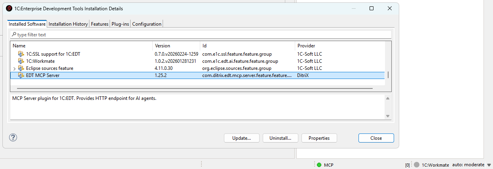

[](https://github.com/DitriXNew/EDT-MCP/releases)

# EDT MCP Server

MCP (Model Context Protocol) server plugin for 1C:EDT, enabling AI assistants (Claude, GitHub Copilot, Cursor, etc.) to interact with EDT workspace.

## Features

- 🔧 **MCP Protocol 2025-11-25** - Streamable HTTP transport with SSE support
- 📊 **Project Information** - List workspace projects and configuration properties
- 🔴 **Error Reporting** - Get errors, warnings, problem summaries with filters
- 📝 **Check Descriptions** - Get check documentation from markdown files
- 🔄 **Project Revalidation** - Trigger revalidation when validation gets stuck
- 🔖 **Bookmarks & Tasks** - Access bookmarks and TODO/FIXME markers
- 💡 **Content Assist** - Get type info, method hints and platform documentation at any code position
- 🧪 **Query Validation** - Validate 1C query text in project context (syntax + semantic errors, optional DCS mode)
- 🧩 **BSL Code Analysis** - Browse modules, inspect structure, read methods, search code, and analyze call hierarchy
- 🖼️ **Form Screenshot Capture** - Get PNG screenshots from the form WYSIWYG editor for visual inspection
- 🚀 **Application Management** - Get applications, update database, launch in debug mode
- 🎯 **Status Bar** - Real-time server status with tool name, execution time, and interactive controls
- ⚡ **Interruptible Operations** - Cancel long-running operations and send signals to AI agent
- 🏷️ **Metadata Tags** - Organize objects with custom tags, filter Navigator, keyboard shortcuts (Ctrl+Alt+1-0), multiselect support
- 📁 **Metadata Groups** - Create custom folder hierarchy in Navigator tree per metadata collection

## Installation

**Only EDT 2025.2.0+**

### From Update Site

1. In EDT: **Help → Install New Software...**
2. Add update site URL: `https://ditrixnew.github.io/EDT-MCP/`
3. Select **EDT MCP Server Feature**
4. Restart EDT

### Windows command line - "one shot" very fast install

"\your\path\to\EDT\components\1c-edt-%VER_EDT%-x86_64\1cedt.exe" -nosplash -application org.eclipse.equinox.p2.director -repository https://ditrixnew.github.io/EDT-MCP -installIU com.ditrix.edt.mcp.server.feature.feature.group -profileProperties org.eclipse.update.reconcile=true

where (for example):
%VER_EDT% = 2025.2.3+30

### Installation Result

Once the installation has been completed successfully, we will see the following:



After that, EDT will automatically monitor the update site and install available updates when detected.
As well, we can also manually check via **Help → Check for Updates**

### Configuration

Go to **Window → Preferences → MCP Server**:
- **Server Port**: HTTP port (default: 8765)
- **Check descriptions folder**: Path to check description markdown files
- **Auto-start**: Start server on EDT launch
- **Default result limit**: Default number of results returned by tools (default: 100)
- **Maximum result limit**: Maximum number of results that can be requested (default: 1000)
- **Plain text mode (Cursor compatibility)**: Returns results as plain text instead of embedded resources (for AI clients that don't support MCP resources)
- **Show tags in Navigator**: Display tags as decorations in the Navigator tree
- **Tag decoration style**: How tags are displayed — all tags as suffix, first tag only, or tag count


## Status Bar Controls

The MCP server status bar shows real-time execution status with interactive controls.

**Status Indicator:**
- 🟢 **Green** - Server running, idle
- 🟡 **Yellow blinking** - Tool is executing
- ⚪ **Grey** - Server stopped


<details>
<summary><strong>User Signal Controls</strong> - Send signals to AI agent during tool execution</summary>

**During Tool Execution:**
- Shows tool name (e.g., `MCP: update_database`)
- Shows elapsed time in MM:SS format
- Click to access control menu

When a tool is executing, you can send signals to the AI agent to interrupt the MCP call:

| Button | Description | When to Use |
|--------|-------------|-------------|
| **Cancel Operation** | Stops the MCP call and notifies agent | When you want to cancel a long-running operation |
| **Retry** | Tells agent to retry the operation | When an EDT error occurred and you want to try again |
| **Continue in Background** | Notifies agent the operation is long-running | When you want agent to check status periodically |
| **Ask Expert** | Stops and asks agent to consult with you | When you need to provide guidance |
| **Send Custom Message...** | Send a custom message to agent | For any custom instruction |

**How it works:**
1. When you click a button, a dialog appears showing the message that will be sent to the agent
2. You can edit the message before sending
3. The MCP call is immediately interrupted and returns control to the agent
4. The EDT operation continues running in the background
5. Agent receives a response like:
```
USER SIGNAL: Your message here

Signal Type: CANCEL
Tool: update_database
Elapsed: 20s

Note: The EDT operation may still be running in background.
```

**Use cases:**
- Long-running operations (full database update, project validation) blocking the agent
- Need to give the agent additional instructions
- EDT showed an error dialog and you want agent to retry
- Want to switch agent's focus to a different task

</details>

## Connecting AI Assistants

### VS Code / GitHub Copilot

Create `.vscode/mcp.json`:
```json
{
  "servers": {
    "EDT MCP Server": {
      "type": "sse",
      "url": "http://localhost:8765/mcp"
    }
  }
}
```

<details>
<summary><strong>Other AI Assistants</strong> - Cursor, Claude Code, Claude Desktop</summary>

### Cursor IDE

> **Note:** Cursor doesn't support MCP embedded resources. Enable **"Plain text mode (Cursor compatibility)"** in EDT preferences: **Window → Preferences → MCP Server**.

Create `.cursor/mcp.json`:
```json
{
  "mcpServers": {
    "EDT MCP Server": {
      "url": "http://localhost:8765/mcp"
    }
  }
}
```

### Claude Code

> **Note:** By editing the file `.claude.json` can be added to the MCP either to a specific project or to any project (at the root). If there is no mcpServers section, add it.

Add to `.claude.json` (in Windows `%USERPROFILE%\.claude.json`):
```json
"mcpServers": {
  "EDT MCP Server": {
    "type": "http",
    "url": "http://localhost:8765/mcp"
  }
}
```

### Claude Desktop

Add to `claude_desktop_config.json`:
```json
{
  "mcpServers": {
    "EDT MCP Server": {
      "url": "http://localhost:8765/mcp"
    }
  }
}
```

### Cline - extension for VSCode.

```json
{
  "mcpServers": {
    "EDTMCPServer": {
      "type": "streamableHttp",
      "url": "http://localhost:8765/mcp"
    }
  }
}
```

</details>

## Available Tools

| Tool | Description |
|------|-------------|
| `get_edt_version` | Returns current EDT version |
| `list_projects` | Lists workspace projects with properties |
| `get_configuration_properties` | Gets 1C configuration properties |
| `get_project_errors` | Returns EDT problems with severity/checkId/objects filters |
| `get_problem_summary` | Problem counts grouped by project and severity |
| `clean_project` | Cleans project markers and triggers full revalidation |
| `revalidate_objects` | Revalidates specific objects by FQN (e.g. "Document.MyDoc") |
| `get_bookmarks` | Returns workspace bookmarks |
| `get_tasks` | Returns TODO/FIXME task markers |
| `get_check_description` | Returns check documentation from .md files |
| `get_content_assist` | Get content assist proposals (type info, method hints) |
| `get_platform_documentation` | Get platform type documentation (methods, properties, constructors) |
| `get_metadata_objects` | Get list of metadata objects from 1C configuration |
| `get_metadata_details` | Get detailed properties of metadata objects (attributes, tabular sections, etc.) |
| `find_references` | Find all references to a metadata object (in metadata, BSL code, forms, roles, etc.) |
| `get_tags` | Get list of all tags defined in the project with descriptions and object counts |
| `get_objects_by_tags` | Get metadata objects filtered by tags with tag descriptions and object FQNs |
| `get_applications` | Get list of applications (infobases) for a project with update state |
| `update_database` | Update database (infobase) with full or incremental update mode |
| `debug_launch` | Launch application in debug mode (auto-updates database before launch) |
| `get_form_screenshot` | Capture PNG screenshot of form WYSIWYG editor (embedded image resource) |
| `list_modules` | List all BSL modules in a project with module type and parent object |
| `get_module_structure` | Get BSL module structure: procedures/functions, signatures, regions, parameters |
| `read_module_source` | Read BSL module source code with line numbers (full file or line range) |
| `read_method_source` | Read a specific procedure/function from a BSL module by name |
| `search_in_code` | Full-text/regex search across BSL modules with outputMode: full/count/files |
| `get_method_call_hierarchy` | Find method callers or callees via semantic BSL analysis |
| `go_to_definition` | Navigate to symbol definition (method by name, metadata object by FQN) |
| `get_symbol_info` | Get type/hover info about a symbol at a BSL code position (inferred types, signatures, docs) |
| `validate_query` | Validate 1C query text in project context (syntax + semantic errors, optional DCS mode) |

<details>
<summary><strong>Tool Details</strong> - Parameters and usage examples for each tool</summary>

### Content Assist Tool

**`get_content_assist`** - Get content assist proposals at a specific position in BSL code. Returns type information, available methods, properties, and platform documentation.

**Parameters:**
| Parameter | Required | Description |
|-----------|----------|-------------|
| `projectName` | Yes | EDT project name |
| `filePath` | Yes | Path relative to `src/` folder (e.g. `CommonModules/MyModule/Module.bsl`) |
| `line` | Yes | Line number (1-based) |
| `column` | Yes | Column number (1-based) |
| `limit` | No | Maximum proposals to return (default: from preferences) |
| `offset` | No | Skip first N proposals (for pagination, default: 0) |
| `contains` | No | Filter by display string containing these substrings (comma-separated, e.g. `Insert,Add`) |
| `extendedDocumentation` | No | Return full documentation (default: false, only display string) |

**Important Notes:**
1. **Save the file first** - EDT must read the current content from disk to provide accurate proposals
2. **Column position** - Place cursor after the dot (`.`) for method/property suggestions
3. **Pagination** - Use `offset` to get next batch of proposals (e.g., first call with limit=5, second call with offset=5, limit=5)
4. **Filtering** - Use `contains` to filter by method/property name (case-insensitive)
5. **Works for:**
   - Global platform methods (e.g. `NStr(`, `Format(`)
   - Methods after dot (e.g. `Structure.Insert`, `Array.Add`)
   - Object properties and fields
   - Configuration objects and modules

### Validation Tools

- **`clean_project`**: Refreshes project from disk, clears all validation markers, and triggers full revalidation using EDT's ICheckScheduler
- **`revalidate_objects`**: Revalidates specific metadata objects by their FQN:
  - `Document.MyDocument`, `Catalog.MyCatalog`, `CommonModule.MyModule`
  - `Document.MyDoc.Form.MyForm` for nested objects
- **`validate_query`**: Validates query language text in project context and returns syntax/semantic errors.
  - Parameters: `projectName` (required), `queryText` (required), `dcsMode` (optional, default `false`)
  - Use `dcsMode=true` for Data Composition System (DCS) queries

### Project Errors Tool

**`get_project_errors`** - Get detailed configuration problems from EDT with multiple filter options.

**Parameters:**
| Parameter | Required | Description |
|-----------|----------|-------------|
| `projectName` | No | Filter by project name |
| `severity` | No | Filter by severity: `ERRORS`, `BLOCKER`, `CRITICAL`, `MAJOR`, `MINOR`, `TRIVIAL` |
| `checkId` | No | Filter by check ID substring (e.g. `ql-temp-table-index`) |
| `objects` | No | Filter by object FQNs (array). Returns errors only from specified objects |
| `limit` | No | Maximum results (default: 100, max: 1000) |

**Objects filter format:**
- Array of FQN strings: `["Document.SalesOrder", "Catalog.Products"]`
- Case-insensitive partial matching
- Matches against error location (objectPresentation)
- FQN examples:
  - `Document.SalesOrder` - all errors in document
  - `Catalog.Products` - all errors in catalog
  - `CommonModule.MyModule` - all errors in common module
  - `Document.SalesOrder.Form.ItemForm` - errors in specific form

### Platform Documentation Tool

**`get_platform_documentation`** - Get documentation for platform types (ValueTable, Array, Structure, Query, etc.) and built-in functions (FindFiles, Message, Format, etc.)

**Parameters:**
| Parameter | Required | Description |
|-----------|----------|-------------|
| `typeName` | Yes | Type or function name (e.g. `ValueTable`, `Array`, `FindFiles`, `Message`) |
| `category` | No | Category: `type` (platform types), `builtin` (built-in functions). Default: `type` |
| `projectName` | No | EDT project name (uses first available project if not specified) |
| `memberName` | No | Filter by member name (partial match) - only for `type` category |
| `memberType` | No | Filter: `method`, `property`, `constructor`, `event`, `all` (default: `all`) - only for `type` category |
| `language` | No | Output language: `en` or `ru` (default: `en`) |
| `limit` | No | Maximum results (default: 50) - only for `type` category |

### Metadata Objects Tool

**`get_metadata_objects`** - Get list of metadata objects from 1C configuration.

**Parameters:**
| Parameter | Required | Description |
|-----------|----------|-------------|
| `projectName` | Yes | EDT project name |
| `metadataType` | No | Filter: `all`, `documents`, `catalogs`, `informationRegisters`, `accumulationRegisters`, `commonModules`, `enums`, `constants`, `reports`, `dataProcessors`, `exchangePlans`, `businessProcesses`, `tasks`, `commonAttributes`, `eventSubscriptions`, `scheduledJobs` (default: `all`) |
| `nameFilter` | No | Partial name match filter (case-insensitive) |
| `limit` | No | Maximum results (default: 100) |
| `language` | No | Language code for synonyms (e.g. `en`, `ru`). Uses configuration default if not specified |

### Metadata Details Tool

**`get_metadata_details`** - Get detailed properties of metadata objects.

**Parameters:**
| Parameter | Required | Description |
|-----------|----------|-------------|
| `projectName` | Yes | EDT project name |
| `objectFqns` | Yes | Array of FQNs (e.g. `["Catalog.Products", "Document.SalesOrder"]`) |
| `full` | No | Return all properties (`true`) or only key info (`false`). Default: `false` |
| `language` | No | Language code for synonyms. Uses configuration default if not specified |

### Find References Tool

**`find_references`** - Find all references to a metadata object. Returns all places where the object is used: in other metadata objects, BSL code, forms, roles, subsystems, etc. Matches EDT's built-in "Find References" functionality.

**Parameters:**
| Parameter | Required | Description |
|-----------|----------|-------------|
| `projectName` | Yes | EDT project name |
| `objectFqn` | Yes | Fully qualified name (e.g. `Catalog.Products`, `Document.SalesOrder`, `CommonModule.Common`) |
| `limit` | No | Maximum results per category (default: 100, max: 500) |

**Returns markdown with references in EDT-compatible format:**

```markdown
# References to Catalog.Items

**Total references found:** 122

- Catalog.ItemKeys - Attributes.Item.Type - Type: types
- Catalog.ItemKeys.Form.ChoiceForm.Form - Items.List.Item.Data path - Type: types
- Catalog.Items - Attributes.PackageUnit.Choice parameter links - Ref
- Catalog.Items.Form.ItemForm.Form - Items.GroupTop.GroupMainAttributes.Code.Data path - Type: types
- CommonAttribute.Author - Content - metadata
- Configuration - Catalogs - catalogs
- DefinedType.typeItem - Type - Type: types
- EventSubscription.BeforeWrite_CatalogsLockDataModification - Source - Type: types
- Role.FullAccess.Rights - Role rights - object
- Subsystem.Settings.Subsystem.Items - Content - content

### BSL Modules

- CommonModules/GetItemInfo/Module.bsl [Line 199; Line 369; Line 520]
- Catalogs/Items/Forms/ListForm/Module.bsl [Line 18; Line 19]
```

**Reference types included:**
- **Metadata references** - Attributes, form items, command parameters, type descriptions
- **Type usages** - DefinedTypes, ChartOfCharacteristicTypes, type compositions
- **Common attributes** - Objects included in common attribute content
- **Event subscriptions** - Source objects for subscriptions
- **Roles** - Objects with role permissions
- **Subsystems** - Subsystem content
- **BSL code** - References in BSL modules with line numbers

### Tag Management Tools

#### Get Tags Tool

**`get_tags`** - Get list of all tags defined in the project. Tags are user-defined labels for organizing metadata objects.

**Parameters:**
| Parameter | Required | Description |
|-----------|----------|-------------|
| `projectName` | Yes | EDT project name |

**Returns:** Markdown table with tag name, color, description, and number of assigned objects.

#### Get Objects By Tags Tool

**`get_objects_by_tags`** - Get metadata objects filtered by tags. Returns objects that have any of the specified tags.

**Parameters:**
| Parameter | Required | Description |
|-----------|----------|-------------|
| `projectName` | Yes | EDT project name |
| `tags` | Yes | Array of tag names to filter by (e.g. `["Important", "NeedsReview"]`) |
| `limit` | No | Maximum objects per tag (default: 100) |

**Returns:** Markdown with sections for each tag including:
- Tag color and description
- Table of object FQNs assigned to the tag
- Summary with total objects found

### Application Management Tools

#### Get Applications Tool

**`get_applications`** - Get list of applications (infobases) for a project. Returns application ID, name, type, and current update state. Use this to get application IDs for `update_database` and `debug_launch` tools.

**Parameters:**
| Parameter | Required | Description |
|-----------|----------|-------------|
| `projectName` | Yes | EDT project name |

#### Update Database Tool

**`update_database`** - Update database (infobase) configuration. Supports full and incremental update modes.

**Parameters:**
| Parameter | Required | Description |
|-----------|----------|-------------|
| `projectName` | Yes | EDT project name |
| `applicationId` | Yes | Application ID from `get_applications` |
| `fullUpdate` | No | If true - full reload, if false - incremental update (default: false) |
| `autoRestructure` | No | Automatically apply restructurization if needed (default: true) |

#### Debug Launch Tool

**`debug_launch`** - Launch application in debug mode. Automatically updates database before launching and finds existing launch configuration.

**Parameters:**
| Parameter | Required | Description |
|-----------|----------|-------------|
| `projectName` | Yes | EDT project name |
| `applicationId` | Yes | Application ID from `get_applications` |
| `updateBeforeLaunch` | No | If true - update database before launching (default: true) |

**Notes:**
- Requires a launch configuration to be created in EDT first (Run → Run Configurations...)
- If no configuration exists, returns list of available configurations
- `updateBeforeLaunch=true` skips update if database is already up to date

### BSL Code Analysis Tools

#### List Modules Tool

**`list_modules`** - List all BSL modules in an EDT project. Can filter by metadata type or specific object name. Returns module path, type, and parent object.

**Parameters:**
| Parameter | Required | Description |
|-----------|----------|-------------|
| `projectName` | Yes | EDT project name |
| `metadataType` | No | Filter: `all`, `documents`, `catalogs`, `commonModules`, `informationRegisters`, `accumulationRegisters`, `reports`, `dataProcessors`, `exchangePlans`, `businessProcesses`, `tasks`, `constants`, `commonCommands`, `commonForms`, `webServices`, `httpServices` (default: `all`) |
| `objectName` | No | Name of specific metadata object to list modules for (e.g. `Products`) |
| `nameFilter` | No | Substring filter on module path (case-insensitive) |
| `limit` | No | Maximum results (default: 200, max: 1000) |

#### Get Module Structure Tool

**`get_module_structure`** - Get structure of a BSL module: all procedures/functions with signatures, line numbers, regions, execution context (`&AtServer`, `&AtClient`), export flag, and parameters.

**Parameters:**
| Parameter | Required | Description |
|-----------|----------|-------------|
| `projectName` | Yes | EDT project name |
| `modulePath` | Yes | Path from `src/` folder (e.g. `CommonModules/MyModule/Module.bsl`) |
| `includeVariables` | No | Include module-level variable declarations (default: `false`) |
| `includeComments` | No | Include doc-comments for methods (default: `false`) |

**Returns:** Markdown with:

- Module summary (procedure/function counts, total lines)
- Regions list with line ranges
- Methods table: type, name, export, context, lines, parameters, region, description (when `includeComments=true`)
- Variables table: name, export flag, line, region (when `includeVariables=true`)

#### Read Module Source Tool

**`read_module_source`** - Read BSL module source code from EDT project. Returns source with line numbers. Supports reading full file or a specific line range. Max 5000 lines per call.

**Parameters:**
| Parameter | Required | Description |
|-----------|----------|-------------|
| `projectName` | Yes | EDT project name |
| `modulePath` | Yes | Path from `src/` folder (e.g. `CommonModules/MyModule/Module.bsl` or `Documents/SalesOrder/ObjectModule.bsl`) |
| `startLine` | No | Start line number (1-based, inclusive). If omitted, reads from beginning |
| `endLine` | No | End line number (1-based, inclusive). If omitted, reads to end |

#### Read Method Source Tool

**`read_method_source`** - Read a specific procedure/function from a BSL module by name. Returns method source code with line numbers and signature. If method not found, returns list of all available methods.

**Parameters:**
| Parameter | Required | Description |
|-----------|----------|-------------|
| `projectName` | Yes | EDT project name |
| `modulePath` | Yes | Path from `src/` folder (e.g. `CommonModules/MyModule/Module.bsl`) |
| `methodName` | Yes | Name of the procedure/function to read (case-insensitive) |

**Returns:** Method source code with:

- Method type (Procedure/Function), signature, export flag
- Line range and line count
- Source code with line numbers

#### Search in Code Tool

**`search_in_code`** - Full-text search across all BSL modules in a project. Supports plain text and regex patterns, case sensitivity, context lines around matches, and file path filtering.

**Parameters:**
| Parameter | Required | Description |
|-----------|----------|-------------|
| `projectName` | Yes | EDT project name |
| `query` | Yes | Search string or regex pattern |
| `caseSensitive` | No | Case-sensitive search (default: `false`) |
| `isRegex` | No | Treat query as regular expression (default: `false`) |
| `maxResults` | No | Maximum number of matches to return with context (default: 100, max: 500) |
| `contextLines` | No | Lines of context before/after each match (default: 2, max: 5) |
| `fileMask` | No | Filter by module path substring (e.g. `CommonModules` or `Documents/SalesOrder`) |
| `outputMode` | No | Output mode: `full` (matches with context, default), `count` (only total count, fast), `files` (file list with match counts, no context) |
| `metadataType` | No | Filter by metadata type: `documents`, `catalogs`, `commonModules`, `informationRegisters`, `accumulationRegisters`, `reports`, `dataProcessors`, `exchangePlans`, `businessProcesses`, `tasks`, `constants`, `commonCommands`, `commonForms`, `webServices`, `httpServices` |

#### Get Method Call Hierarchy Tool

**`get_method_call_hierarchy`** - Find method call hierarchy: who calls this method (callers) or what this method calls (callees). Uses semantic BSL analysis via BM-index, not text search.

**Parameters:**
| Parameter | Required | Description |
|-----------|----------|-------------|
| `projectName` | Yes | EDT project name |
| `modulePath` | Yes | Path from `src/` folder (e.g. `CommonModules/MyModule/Module.bsl`) |
| `methodName` | Yes | Name of the procedure/function (case-insensitive) |
| `direction` | No | `callers` (who calls this method, default) or `callees` (what this method calls) |
| `limit` | No | Maximum results (default: 100, max: 500) |

**Notes:**

- Requires EMF model (BSL AST) — does not work in text fallback mode
- `callers` uses IReferenceFinder to search across the entire project
- `callees` traverses the method's AST to find all invocations

### Go To Definition Tool

**`go_to_definition`** - Navigate to the definition of a symbol. Resolves method calls like `CommonModuleName.MethodName` to the actual definition with source code, signature, and location. Also resolves metadata object FQNs like `Catalog.Products`. Supports both English and Russian metadata type names.

**Parameters:**
| Parameter | Required | Description |
|-----------|----------|-------------|
| `projectName` | Yes | EDT project name |
| `symbol` | Yes | Symbol to find definition for. Formats: `ModuleName.MethodName` (method in a common module), `MethodName` (method in context module, requires `modulePath`), `Catalog.Products` (metadata object FQN). Russian metadata type names are also supported |
| `modulePath` | No | Context module path from `src/` folder (e.g. `Documents/SalesOrder/ObjectModule.bsl`). Required when symbol is an unqualified method name |
| `includeSource` | No | Include method source code in the response (default: `true`) |

**Returns:** Markdown with:

- Method signature, export flag, line range
- Source code with line numbers (when `includeSource=true`)
- File path for navigation
- For metadata objects: FQN, synonym, available modules

### Get Symbol Info Tool

**`get_symbol_info`** - Get type and hover information about a symbol at a specific position in a BSL module. Returns inferred types, signatures, and documentation — the same info that EDT shows on mouse hover. Useful for understanding variable types in dynamically-typed BSL code.

**Parameters:**
| Parameter | Required | Description |
|-----------|----------|-------------|
| `projectName` | Yes | EDT project name |
| `filePath` | Yes | Path to BSL file relative to project's `src/` folder (e.g. `CommonModules/MyModule/Module.bsl`) |
| `line` | Yes | Line number (1-based) |
| `column` | Yes | Column number (1-based) |

**Returns:** Markdown with symbol information. Uses a multi-level approach:

1. **Editor hover** (best): Returns inferred types, method signatures, documentation — same as IDE hover tooltip
2. **EObject analysis** (fallback): Returns structural info — symbol kind, name, signature, export flag, line range
3. **EMF model** (last resort): Basic node info without opening editor

**Use cases:**

- Determine the inferred type of a variable (BSL is dynamically typed)
- Get method signature and documentation at a call site
- Inspect property types on objects accessed via dot notation
- Understand platform method parameter types

### Output Formats

- **Markdown tools**: `list_projects`, `get_project_errors`, `get_bookmarks`, `get_tasks`, `get_problem_summary`, `get_check_description` - return Markdown as EmbeddedResource with `mimeType: text/markdown`
- **JSON tools**: `get_configuration_properties`, `clean_project`, `revalidate_objects` - return JSON with `structuredContent`
- **Text tools**: `get_edt_version` - return plain text

</details>

## API Endpoints

| Endpoint | Method | Description |
|----------|--------|-------------|
| `/mcp` | POST | MCP JSON-RPC (initialize, tools/list, tools/call) |
| `/mcp` | GET | Server info |
| `/health` | GET | Health check |

## Metadata Tags

Organize your metadata objects with custom tags for easier navigation and filtering.

### Why Use Tags?

Tags help you:
- Group related objects across different metadata types (e.g., all objects for a specific feature)
- Quickly find objects in large configurations
- Filter the Navigator to focus on specific areas of the project
- Share object organization with your team via version control

### Getting Started

**Assigning Tags to Objects:**

1. Right-click on any metadata object in the Navigator
2. Select **Tags** from the context menu
3. Check the tags you want to assign, or select **Manage Tags...** to create new ones


**Managing Tags:**

In the Manage Tags dialog you can:
- Create new tags with custom names, colors, and descriptions
- Edit existing tags (name, color, description)
- Delete tags
- See all available tags for the project


### Viewing Tags in Navigator

Tagged objects show their tags as a suffix in the Navigator tree:


**To enable/disable tag display:**
- **Window → Preferences → General → Appearance → Label Decorations**
- Toggle "Metadata Tags Decorator"

### Filtering Navigator by Tags

Filter the entire Navigator to show only objects with specific tags:

1. Click the tag filter button in the Navigator toolbar (or right-click → **Tags → Filter by Tag...**)
2. Select one or more tags
3. Click **Set** to apply the filter


The Navigator will show only:
- Objects that have ANY of the selected tags
- Parent folders containing matching objects

**To clear the filter:** Click **Turn Off** in the dialog or use the toolbar button again.

### Keyboard Shortcuts for Tags

Quickly toggle tags on selected objects using keyboard shortcuts:

| Shortcut | Action |
|----------|--------|
| **Ctrl+Alt+1** | Toggle 1st tag |
| **Ctrl+Alt+2** | Toggle 2nd tag |
| **...** | ... |
| **Ctrl+Alt+9** | Toggle 9th tag |
| **Ctrl+Alt+0** | Toggle 10th tag |

**Features:**
- Works with multiple selected objects
- Supports cross-project selection (each object uses tags from its own project)
- Pressing the same shortcut again removes the tag (toggle behavior)
- Tag order is configurable in the Manage Tags dialog (Move Up/Move Down buttons)

**To customize shortcuts:** Window → Preferences → General → Keys → search for "Toggle Tag"

### Filtering Untagged Objects

Find metadata objects that haven't been tagged yet:

1. Open Filter by Tag dialog (toolbar button or Tags → Filter by Tag...)
2. Check the **"Show untagged objects only"** checkbox
3. Click **Set**

The Navigator will show only objects that have no tags assigned, making it easy to identify objects that need categorization.

### Multi-Select Tag Assignment

Assign or remove tags from multiple objects at once:

1. Select multiple objects in the Navigator (Ctrl+Click or Shift+Click)
2. Right-click → **Tags**
3. Select a tag to toggle it on/off for ALL selected objects

**Behavior:**
- ✓ Checked = all selected objects have this tag
- ☐ Unchecked = none of the selected objects have this tag
- When objects are from different projects, only objects from projects that have the tag will be affected

### Tag Filter View

For advanced filtering across multiple projects, use the Tag Filter View:

**Window → Show View → Other → MCP Server → Tag Filter**

This view provides:
- **Left panel**: Select tags from all projects in your workspace
- **Right panel**: See all matching objects with search and navigation
- **Search**: Filter results by object name using regex
- **Double-click**: Navigate directly to the object

### Where Tags Are Stored

Tags are stored in `.settings/metadata-tags.yaml` file in each project. This file:
- Can be committed to version control (VCS friendly)
- Is automatically updated when you rename or delete objects
- Uses YAML format for easy readability

**Example:**
```yaml
assignments:
  CommonModule.Utils:
    - Utils
  Document.SalesOrder:
    - Important
    - Sales
tags:
  - color: '#FF0000'
    description: Critical business logic
    name: Important
  - color: '#00FF00'
    description: ''
    name: Utils
  - color: '#0066FF'
    description: Sales department documents
    name: Sales
```

## Metadata Groups

Organize your Navigator tree with custom groups to create a logical folder structure for metadata objects.

### Why Use Groups?

Groups help you:
- Create custom folder hierarchy in the Navigator tree
- Organize objects by business area, feature, or any logical structure
- Navigate large configurations faster with nested groups
- Separate grouped objects from ungrouped ones

### Getting Started

**Creating a Group:**

1. Right-click on any metadata folder (e.g., Catalogs, Common modules) in the Navigator
2. Select **New Group...** from the context menu
3. Enter the group name and optional description
4. Click **OK** to create the group


**Create Group Dialog:**


**Adding Objects to a Group:**

1. Right-click on any metadata object in the Navigator
2. Select **Add to Group...**
3. Choose the target group from the list


**Removing Objects from a Group:**

1. Right-click on an object inside a group
2. Select **Remove from Group**

### Viewing Groups in Navigator

Grouped objects appear inside their group folders in the Navigator tree:


**Key Features:**
- Groups are created per metadata collection (Catalogs, Common modules, Documents, etc.)
- Objects inside groups are still accessible via standard EDT navigation
- Ungrouped objects appear at the end of the list

### Group Operations

| Action | How to Do It |
|--------|--------------|
| Create group | Right-click folder → **New Group...** |
| Add object to group | Right-click object → **Add to Group...** |
| Remove from group | Right-click object in group → **Remove from Group** |
| Copy group name | Select group → **Ctrl+C** |
| Delete group | Right-click group → **Delete** |
| Rename group | Right-click group → **Rename...** |

### Where Groups Are Stored

Groups are stored in `.settings/groups.yaml` file in each project. This file:
- Can be committed to version control (VCS friendly)
- Uses YAML format for easy readability
- Is automatically updated when you rename or delete objects

**Example:**
```yaml
groups:
- name: "Products & Inventory"
  description: "Product and inventory catalogs"
  path: Catalog
  order: 0
  children:
    - Catalog.ItemKeys
    - Catalog.Items
    - Catalog.ItemSegments
    - Catalog.Units
    - Catalog.UnitsOfMeasurement
- name: "Organization"
  description: "Organization structure catalogs"
  path: Catalog
  order: 1
  children:
    - Catalog.Companies
    - Catalog.Stores
- name: "Core Functions"
  description: "Core shared functions used across the application"
  path: CommonModule
  order: 0
  children:
    - CommonModule.CommonFunctionsClient
    - CommonModule.CommonFunctionsServer
    - CommonModule.CommonFunctionsClientServer
- name: "Localization"
  description: "Multi-language support modules"
  path: CommonModule
  order: 1
  children:
    - CommonModule.Localization
    - CommonModule.LocalizationClient
    - CommonModule.LocalizationServer
    - CommonModule.LocalizationReuse
```

## Requirements

- 1C:EDT 2025.2 (Ruby) or later
- Java 17+

## Version History

<details>
<summary><strong>1.24.6</strong> - Symbol info tool, connection stability, bilingual FQN support</summary>

- **New**: `get_symbol_info` tool — get type/hover information about a symbol at a BSL code position
  - Returns inferred types, method signatures, and documentation (same as EDT hover tooltip)
  - Multi-level approach: editor hover → EObject analysis → EMF fallback
  - Pre-validates position to avoid returning contextual info for whitespace/comments
  - Useful for understanding variable types in dynamically-typed BSL code
- **Improved**: Connection stability — reduced "socket connection was closed unexpectedly" errors
  - Split into two thread pools: main pool (8 threads, queue 200) for POST/DELETE requests and dedicated SSE pool (max 10) for long-lived event streams — prevents SSE connections from starving request processing
  - Two-level overload protection: admission control (threshold 50) returns HTTP 503 + `Retry-After` instantly; bounded queue (200) acts as memory safety net
  - SSE pool returns HTTP 503 when connection limit (10) is exceeded
  - Reduced SSE heartbeat interval from 15s to 5s to prevent proxy/client timeouts
  - Added HTTP server timeout configuration (idle: 300s, request/response: 600s)
  - Added `Connection: keep-alive` header to JSON responses
  - Improved error handling with graceful recovery on client disconnection
- **Improved**: `get_project_errors` tool — full bilingual FQN support
  - Accepts both English and Russian metadata type names (e.g. 'Document.SalesOrder' or 'Документ.ПродажаТоваров')
  - Automatically matches markers regardless of configuration language
- **Improved**: `revalidate_objects` tool — Russian metadata type names support
  - FQN normalization via `MetadataTypeUtils.normalizeFqn()` before BM API calls

</details>

<details>
<summary><strong>1.24.1</strong> - Query validation tool</summary>

- **New**: `validate_query` tool validates 1C query text in project context
  - Returns syntax and semantic issues with line/column/offset
  - Supports `dcsMode=true` for Data Composition System (DCS) query validation

</details>

<details>
<summary><strong>1.23.1</strong> - GoToDefinition tool and metadata type utilities</summary>

- **New**: `go_to_definition` tool for navigating to symbol definitions
  - Navigate to procedure/function implementation by name
  - Supports both English and Russian metadata type names
  - Returns file path and line number for quick navigation
- **Enhanced**: Metadata type name normalization
  - Added `MetadataTypeUtils` class for centralized type name resolution
  - Support for various type name forms (plural/singular, Russian/English)
  - Consistent FQN handling across all metadata tools
- **Improved**: `find_references` tool
  - Added Russian metadata type names support in descriptions
  - Enhanced input schema with bilingual type names
- **Improved**: `get_metadata_details` tool
  - Utilizes `MetadataTypeUtils` for type normalization
  - Better handling of Russian type names
- **Improved**: `list_modules` tool
  - Refactored to use `MetadataTypeUtils` for directory name resolution
- **Tests**: Added unit tests for `MetadataTypeUtils`
  - Validates type name resolution across different languages
  - Ensures accurate type name matching

</details>

<details>
<summary><strong>1.23.0</strong> - Form screenshots as image resources</summary>

- **New**: `get_form_screenshot` tool returns PNG image as resource
  - Returns embedded `image/png` resources that AI clients can preview directly in chat
  - Not stable. Some times - return black image. Then try to restart EDT.

</details>

<details>
<summary><strong>1.22.0</strong> - BSL Code Analysis: module browsing, method reading, code search, call hierarchy</summary>

- **New**: `list_modules` tool - List all BSL modules in a project
  - Filter by metadata type (documents, catalogs, commonModules, informationRegisters, accumulationRegisters, accountingRegisters, calculationRegisters, reports, dataProcessors, exchangePlans, businessProcesses, tasks, constants, commonCommands, commonForms, webServices, httpServices)
  - Filter by specific object name or path substring
  - Returns module path, type, and parent object
  - `metadataType=all` uses filesystem scan for 100% coverage of all metadata types (including ChartsOfAccounts, Enums, DocumentJournals, Sequences, etc.)
- **New**: `get_module_structure` tool - Get BSL module structure
  - Lists all procedures/functions with signatures, line numbers, regions
  - Shows execution context (`&AtServer`, `&AtClient`), export flag, parameters
  - Text-based region parsing for accurate region boundaries
  - `includeVariables` parameter - Lists module-level variable declarations with name, export flag, line number, and region (uses `Module.allDeclareStatements()` EMF API with text-based fallback)
  - `includeComments` parameter - Extracts doc-comments (// comment blocks) above each method, adds Description column to methods table (uses NodeModelUtils for AST-based extraction with text-based fallback)
- **New**: `read_module_source` tool - Read BSL module source code
  - Returns source with line numbers
  - Supports reading full file or specific line range
  - Max 5000 lines per call with truncation warning
- **New**: `read_method_source` tool - Read specific procedure/function by name
  - Returns method source with line numbers and full signature
  - Shows method type (Procedure/Function), export flag, line range
  - Lists available methods if requested method not found
- **New**: `search_in_code` tool - Full-text/regex search across BSL modules
  - Plain text and regex patterns with case sensitivity control
  - Context lines around matches (configurable 0-5)
  - File path filtering by substring (`fileMask`)
  - `metadataType` parameter - Filter by metadata type (documents, catalogs, commonModules, etc.) supporting 15 metadata types matching folder structure
  - `outputMode`: `full` (matches with context), `count` (total count, fast), `files` (file list with match counts)
  - Always scans all files for accurate totals even when limit is reached
- **New**: `get_method_call_hierarchy` tool - Semantic method call analysis
  - Find callers (who calls this method) via IReferenceFinder
  - Find callees (what this method calls) via AST traversal
  - Returns caller/callee module, method name, line number, and call code
  - Smart truncation for long calls: `Foo(...)` instead of raw text
  - Comment lines stripped from call code display
  - Shows total reference count even when limit is reached
  - Shared ResourceSet for faster reference resolution

</details>

<details>
<summary><strong>1.20.1</strong> - Navigator toolbar buttons: Expand All, Expand Below, Collapse All</summary>

- **New**: Navigator toolbar buttons for tree expansion control
  - **Expand All**: Expands all nodes in the Navigator tree
  - **Expand Below**: Expands all children under the selected node
  - **Collapse All**: Custom collapse button (replaces standard)
- **Improved**: Toolbar button layout with proper positioning


</details>

<details>
<summary><strong>1.20.0</strong> - Metadata Groups: custom folder hierarchy in Navigator</summary>

- **New**: Metadata Groups feature
  - Create custom folder hierarchy in Navigator tree per metadata collection
  - Organize metadata objects by business area, feature, or any logical structure
  - Context menu: right-click → **New Group...** to create, **Add to Group...** to assign
- **New**: Group management
  - Rename and delete groups via context menu
  - Remove objects from groups
  - Groups stored in `.settings/groups.yaml` (VCS friendly)
- **New**: Create Group dialog
  - Name and description fields
  - Description supports multiline text
- **Improved**: Navigator integration
  - Grouped objects appear inside group folders
  - Ungrouped objects shown at the end
  - Standard EDT navigation still works for grouped objects

</details>

<details>
<summary><strong>1.19.0</strong> - Tag Enhancements: keyboard shortcuts, untagged filter, multiselect</summary>

- **New**: Keyboard shortcuts for tags (Ctrl+Alt+1-0)
  - Toggle first 10 tags with Ctrl+Alt+1 through Ctrl+Alt+0
  - Works with multiple selected objects
  - Supports cross-project selection
  - Customizable via Window → Preferences → General → Keys
- **New**: Move tags up/down in Manage Tags dialog
  - Reorder tags to assign frequently used tags to lower numbers
  - Tag order persists and affects hotkey assignments
- **New**: "Show untagged objects only" filter
  - Checkbox in Filter by Tag dialog
  - Find objects that haven't been tagged yet
- **New**: Multi-select tag assignment
  - Select multiple objects and assign/remove tags from context menu
  - Shows aggregated state across all selected objects
  - Handles objects from different projects correctly
- **New**: Metadata Tags feature
  - Assign custom tags to any metadata object for organization
  - Context menu: right-click → Tags for quick access
  - Manage Tags dialog: create, edit, delete tags with colors and descriptions
  - Tags stored in `.settings/metadata-tags.yaml` (VCS friendly)
- **New**: Tag Decorator in Navigator
  - Shows assigned tags as suffix: `CommonModule.MyModule [Test, Demo]`
  - Enable/disable: Window → Preferences → General → Appearance → Label Decorations
- **New**: Navigator Filter by Tags
  - Filter entire Navigator tree to show only objects with selected tags
  - OR logic: shows objects with ANY of the selected tags
  - Toolbar button and context menu access
- **New**: Tag Filter View
  - Advanced filtering across all projects in workspace
  - Search by FQN with regex support
  - Multi-project support
- **New**: Automatic YAML synchronization
  - Rename/delete operations automatically update tag assignments
  - Works with EDT Undo/Redo

</details>

<details>
<summary><strong>1.18.0</strong> - Application management: get infobases, update database, debug launch</summary>

- **New**: `get_applications` tool - Get list of applications (infobases) for a project
  - Returns application ID, name, type, and current update state
  - Use this to get application IDs for `update_database` and `debug_launch` tools
- **New**: `update_database` tool - Update database (infobase) configuration
  - Supports full update (complete reload) and incremental update (changes only)
  - Auto-applies restructurization when needed
  - Returns detailed status before and after update
- **New**: `debug_launch` tool - Launch application in debug mode
  - Automatically updates database before launching (configurable via `updateBeforeLaunch` parameter)
  - Finds existing launch configuration for project/application
  - Starts debug session directly from AI assistant
- **New**: Status bar enhancements
  - Shows current tool name during execution (e.g., `MCP: update_database`)
  - Shows elapsed time in MM:SS format
  - Yellow blinking indicator during tool execution
  - Wider status bar for full tool names display
- **New**: Interruptible tool execution with user signals
  - Cancel long-running operations and return control to AI agent immediately
  - Send signals: Cancel, Retry, Continue in Background, Ask Expert, Custom Message
  - Dialog preview shows exactly what will be sent to agent
  - EDT operation continues in background while agent receives immediate response

</details>

<details>
<summary><strong>1.17.0</strong> - Find references: search where metadata objects are used</summary>

- **New**: `find_references` tool - Find all references to a metadata object
  - Returns all places where the object is used: roles, subsystems, forms, type descriptions, etc.
  - Results grouped by category (Subsystems, Roles, Forms, Type descriptions, etc.)
  - Searches through produced types, predefined items, fields
  - Note: BSL code references will be added in future version

</details>

<details>
<summary><strong>1.16.0</strong> - Plain text mode for Cursor, object filters, built-in function docs</summary>

- **New**: "Plain text mode (Cursor compatibility)" preference setting
  - When enabled, returns Markdown results as plain text instead of embedded resources
  - Solves compatibility issues with AI clients that don't support MCP embedded resources (e.g., Cursor)
  - Located in: **Window → Preferences → MCP Server**
- **New**: `objects` filter parameter for `get_project_errors` tool
  - Filter errors by specific object FQNs (e.g. `["Document.SalesOrder", "Catalog.Products"]`)
  - Returns only errors from the specified objects
  - FQN matching is case-insensitive and supports partial matches
- **New**: Built-in function documentation in `get_platform_documentation` tool
  - Use `category: "builtin"` to get documentation for global functions (FindFiles, Message, Format, etc.)
  - Returns function signature with parameters, types, optional flags, and return type
  - Supports both English and Russian function names

</details>

<details>
<summary><strong>1.9.0</strong> - Enhanced EObject formatting for metadata tools</summary>

- **Improved**: Enhanced EObject formatting in metadata tools using new `EObjectInspector` utility
  - Smart detection of simple value holders (enums, wrappers) vs complex objects needing expansion
  - Automatic extraction of primary values from wrapper classes (e.g., StandardCommandGroup → category enum)
  - EMF-based detection without hardcoded class names using EAttribute/EReference analysis
  - Better formatting for StandardCommandGroup, Color, Picture, and other wrapper types
- **Internal**: New `EObjectInspector` utility class for EMF EObject type analysis
- **Refactored**: `AbstractMetadataFormatter` and `UniversalMetadataFormatter` now use EObjectInspector

</details>

<details>
<summary><strong>1.8.0</strong> - Metadata objects and details tools</summary>

- **New**: `get_metadata_objects` tool - Get list of metadata objects from 1C configuration
  - Returns Name, Synonym, Comment, Type, ObjectModule, ManagerModule for each object
  - Supports filtering by metadata type (documents, catalogs, registers, commonModules, commonAttributes, eventSubscriptions, scheduledJobs, etc.)
  - Supports partial name filtering (case-insensitive)
  - Uses configuration default language for synonyms
- **New**: `get_metadata_details` tool - Get detailed properties of metadata objects
  - Accepts array of FQNs (e.g. `["Catalog.Products", "Document.SalesOrder"]`)
  - `full` mode for complete property details
  - Type-specific properties (Document: posting, Catalog: hierarchy, Register: periodicity, etc.)

</details>

<details>
<summary><strong>1.7.0</strong> - Platform documentation tool</summary>

- **New**: `get_platform_documentation` tool - Get platform type documentation
  - Returns methods, properties, constructors, events with full documentation
  - Supports all platform types: ValueTable, Array, Structure, Query, Map, etc.
  - Filter by member name or type (method/property/constructor/event)
  - Bilingual output (English/Russian)
  - Uses EDT's IEObjectProvider with TYPE provider for accurate results

</details>

<details>
<summary><strong>1.6.x</strong> - Content assist, JSON improvements, validation tools</summary>

**1.6.16**
- **New**: `get_content_assist` tool - Get content assist proposals at any code position

**1.6.10**
- **Refactored**: All JSON responses now use Gson serialization instead of manual StringBuilder
- **New**: `ToolResult` class - fluent API for building JSON responses

**1.6.0**
- **New**: `clean_project` tool - clears markers and triggers full revalidation via EDT ICheckScheduler
- **New**: `revalidate_objects` tool - revalidates specific objects by FQN

</details>

<details>
<summary><strong>1.5.x - 1.0.0</strong> - Initial releases and core features</summary>

**1.5.0** - Explicit ResponseType per tool, Markdown as EmbeddedResource

**1.4.0** - Converted list tools to Markdown output

**1.3.0** - MCP Protocol 2025-11-25 with Streamable HTTP, SSE transport support

**1.2.0** - EDT IMarkerManager integration, EDT severity levels

**1.0.0** - Initial release

</details>

## License
# Copyright (C) 2026 DitriX
# Licensed under GNU AGPL v3.0

---
*EDT MCP Server v1.24.7*
